# AI SkillHub - Fullstack Project

**Nama:** [Rifky Albuchori]  
**NIM:** [103022400126]  
**Kelas:** [SE-48-04]  
**Studi Kasus:** AI SkillHub (Community-driven AI Skills Repository)

---

## Deskripsi Singkat
AI SkillHub adalah aplikasi web terpusat untuk menemukan, menyimpan, dan membagikan berbagai *AI Skills* serta *Prompts* dari ekosistem AI (Claude, OpenAI, Gemini, hingga Coding Agents) berbasis integrasi GitHub.

---

## Tugas Minggu 2: Struktur HTML Murni

Proyek ini dibangun menggunakan struktur HTML murni tanpa styling CSS/framework dengan pembagian 4 halaman utama:
1. `index.html` - Halaman Beranda / Ringkasan Statistik
2. `skills.html` - Halaman Jelajah & Pencarian Skill
3. `skill-detail.html` - Halaman Detail Informasi Skill
4. `skill-form.html` - Halaman Form Pengiriman Skill Baru

### Penerapan Standar Web:
- **Semantic HTML5:** Menggunakan elemen `<header>`, `<nav>`, `<main>`, `<section>`, `<article>`, `<aside>`, dan `<footer>`.
- **Aksesibilitas (A11y):** Seluruh tag gambar memiliki atribut `alt` deskriptif dan seluruh elemen input terhubung dengan `<label for="...">`.
- **Data Tabular:** Menggunakan tag `<table>`, `<thead>`, `<tbody>`, dan `<caption>` untuk penyajian data.

---

## Screenshot Tampilan Halaman

### 1. Halaman Beranda (`index.html`)
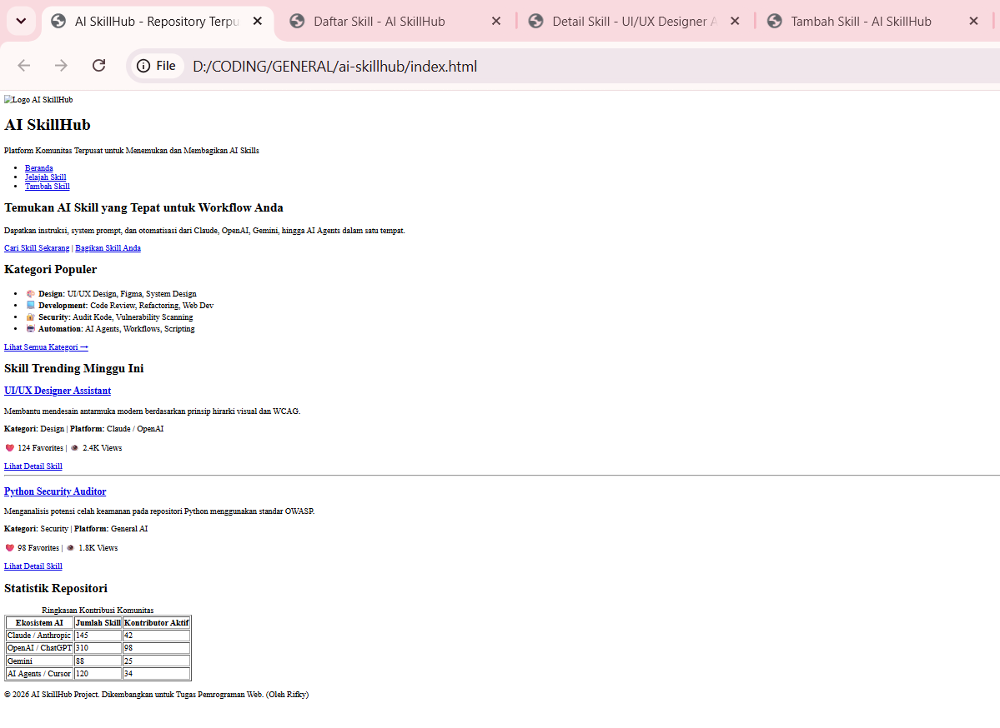

### 2. Halaman Jelajah Skill (`skills.html`)
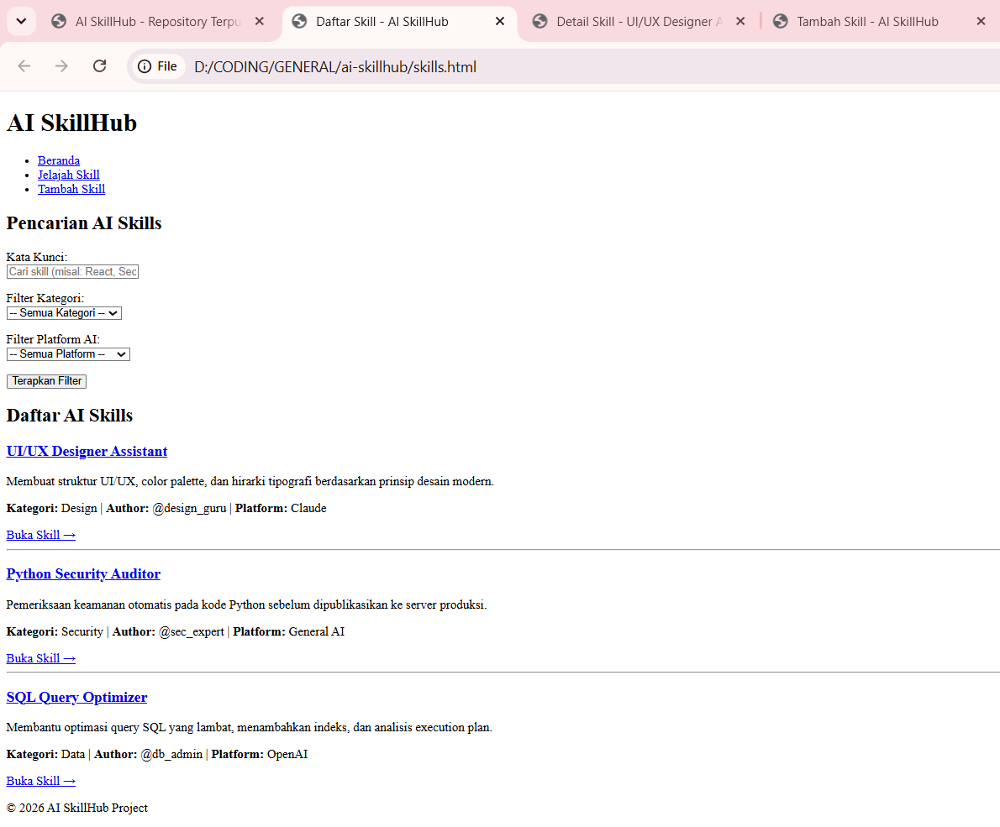

### 3. Halaman Detail Skill (`skill-detail.html`)
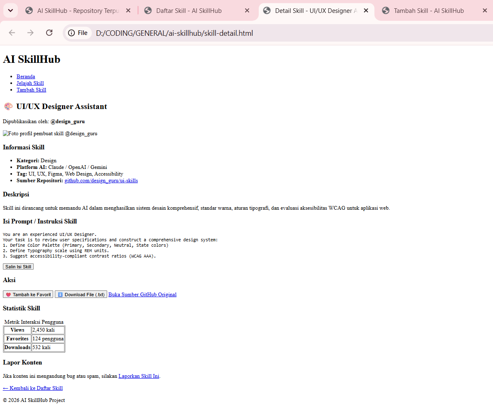

### 4. Halaman Form Submit (`skill-form.html`)
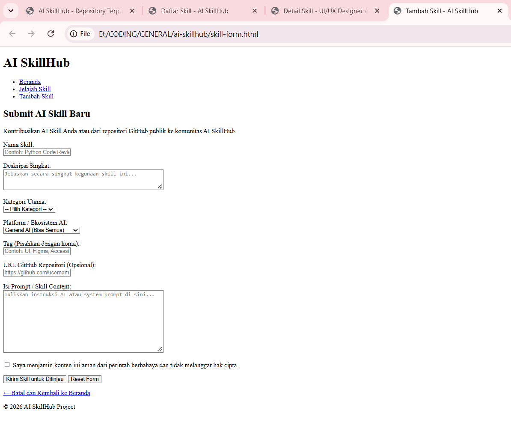

---

## Tugas Minggu 3: Styling dengan CSS

Seluruh halaman terhubung ke satu external stylesheet `style.css` dengan identitas visual terinspirasi Claude Desktop (krem, cokelat gelap, aksen terakota).

### Penerapan CSS:
- **Font:** `font-family`, `font-size`, `font-weight` konsisten untuk judul (serif) dan isi (sans-serif).
- **List:** Navigasi tanpa bullet (horizontal), kategori populer dalam bentuk grid kartu.
- **Text-align:** Hero, judul form, footer rata tengah; caption tabel rata kiri.
- **Warna:** Palet warna disimpan sebagai variabel CSS di `:root`.
- **Div & Span:** `div.brand`, `div.form-group`, `div.hero-actions`, `span.badge` untuk kategori.
- **Responsive:** `@media (max-width: 768px)` membuat navigasi horizontal menjadi vertikal, grid kategori dan layout detail menjadi 1 kolom.

### Screenshot Desktop vs Mobile

|  Halaman |                Desktop                 |                   Mobile               |
|----------------|------------------------------------------------|-----------------------------------------|
|   Beranda      | 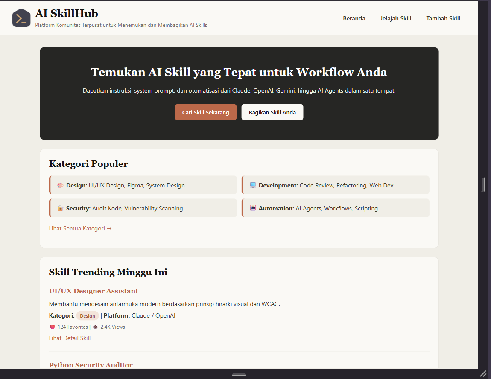          | 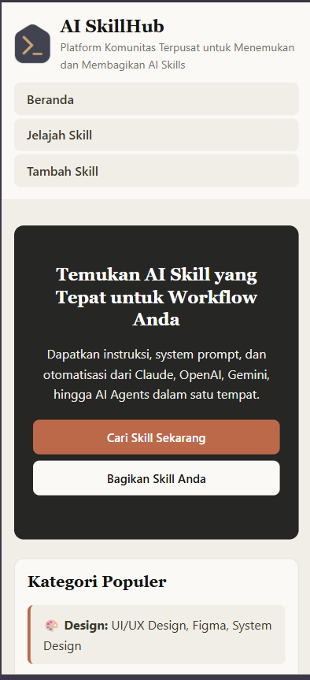 |
| Jelajah Skill  | 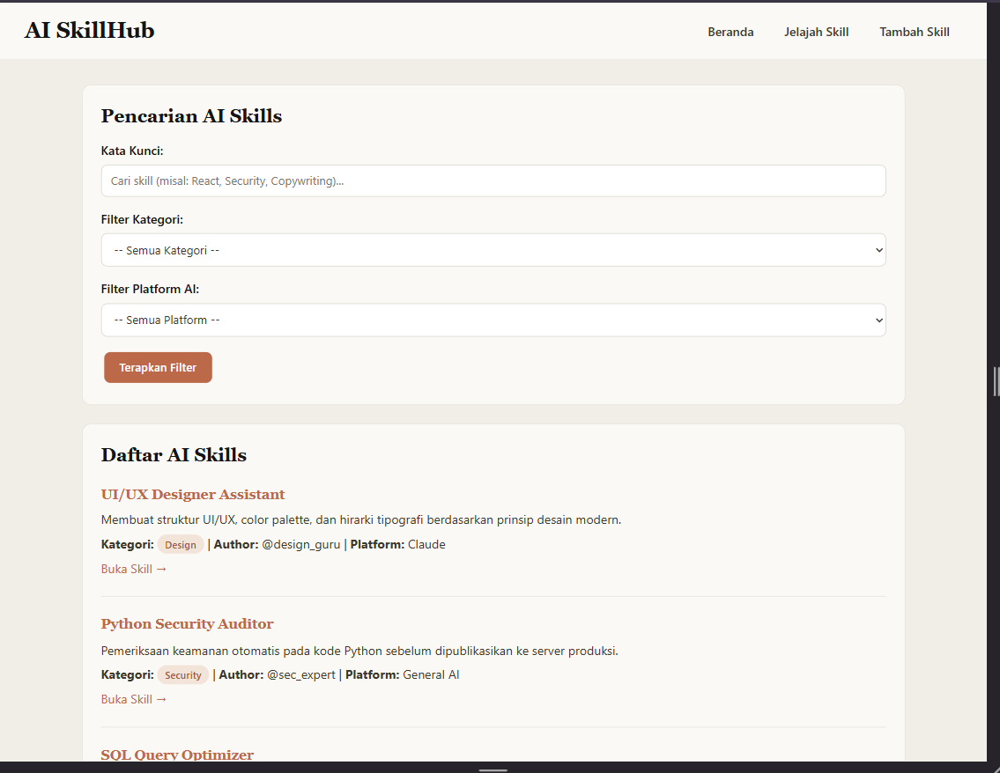         | 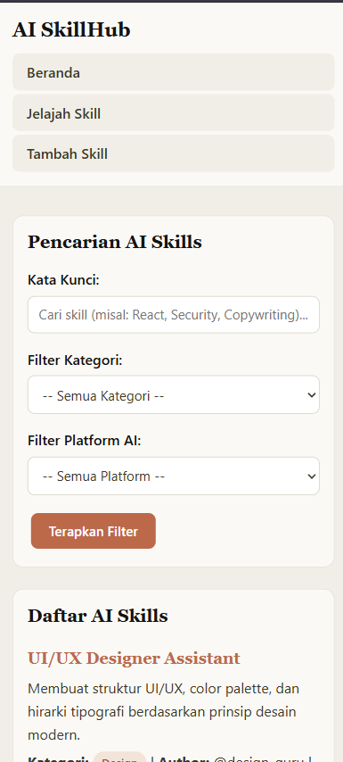 |
| Detail Skill   | 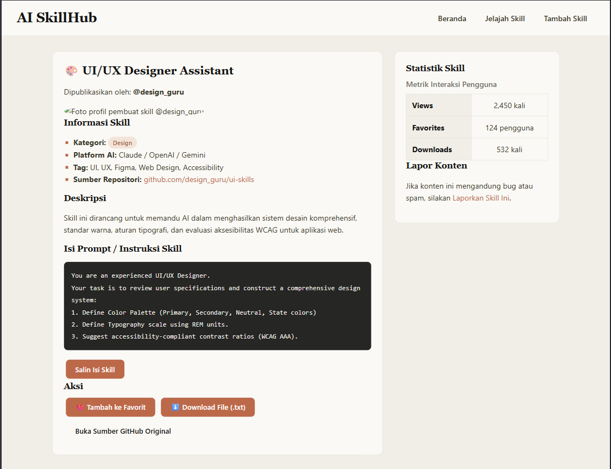    | 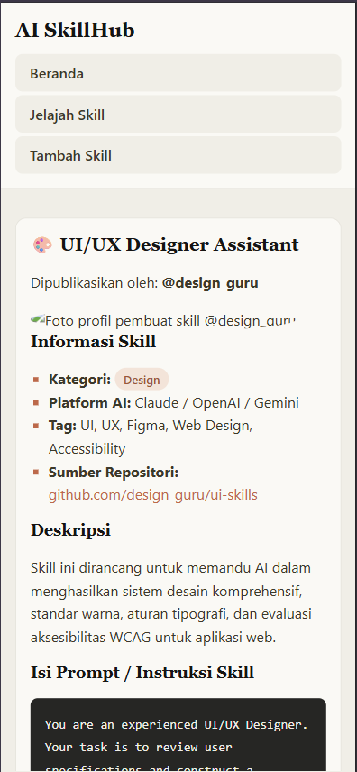 |
| Form Submit    | 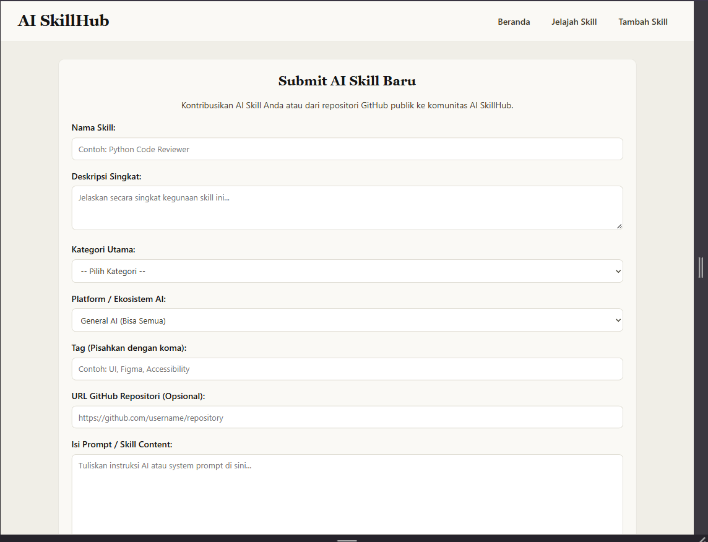     | 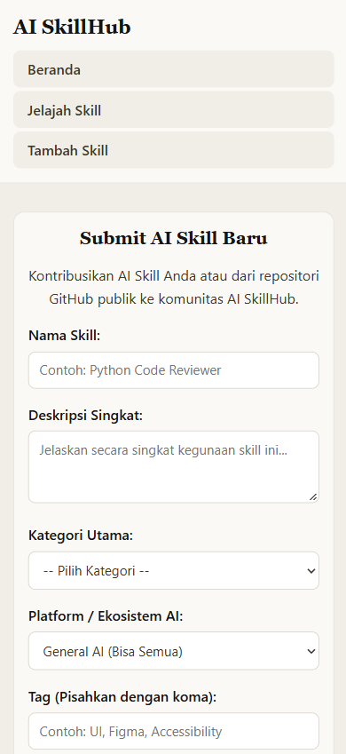 |
